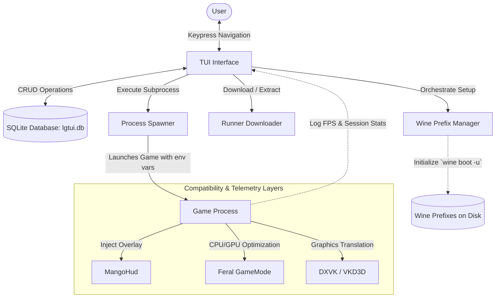
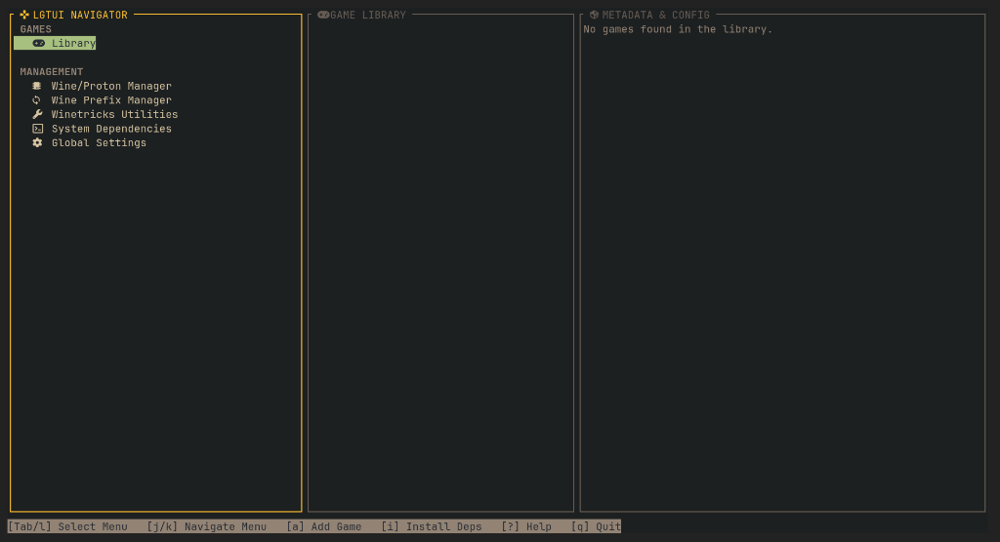
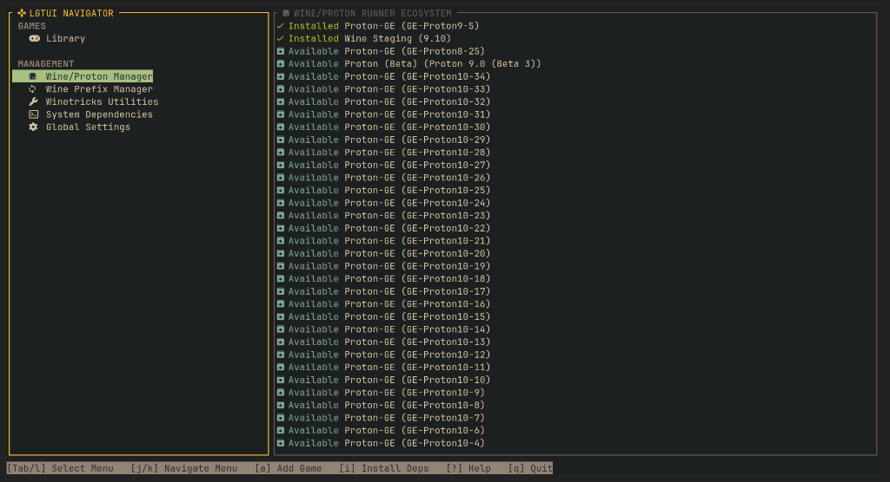
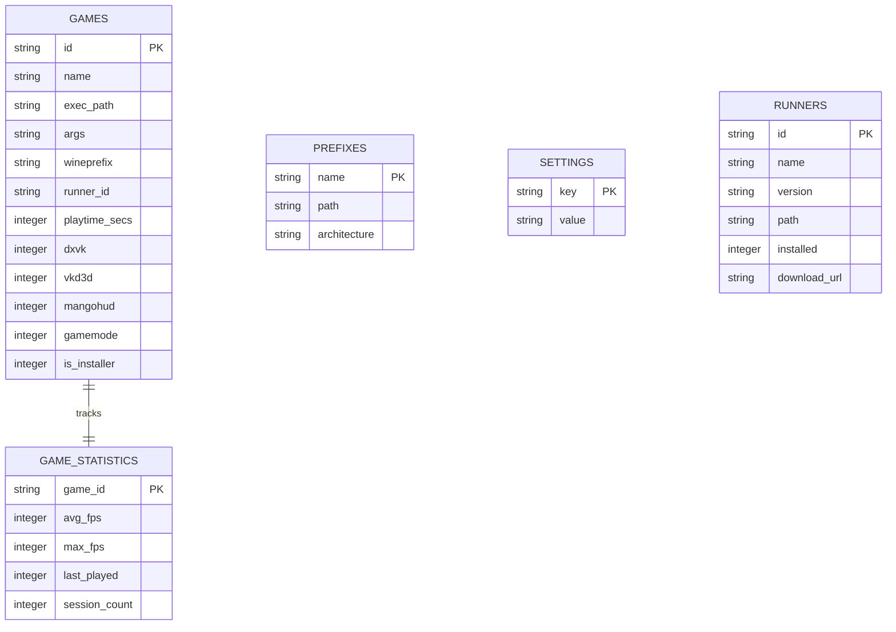

# LinuxGamingTerminalUserInterface (LGTUI)

<p align="center">
  
</p>

<p align="center">
  <a href="https://github.com/ucmz851/lgtui/blob/main/LICENSE"></a>
  
  
  
</p>

---

**LGTUI** is a lightweight, high-performance terminal user interface (TUI) client engineered to streamline game launcher configurations on Linux. It serves as a unified dashboard wrapper for **Wine**, **Proton**, **Winetricks**, **MangoHud**, and **Feral GameMode**, providing sandbox isolation, automated dependency diagnostics, and runtime telemetry logging inside a clean console interface.

Unlike bulky graphical launchers, LGTUI prioritizes speed, efficiency, and minimalism—ideal for terminal-centric Linux setups.

---

## 🏛️ System Architecture

LGTUI operates as an orchestrator between the user, a local SQLite state repository, and various system-level compatibility layers.



---

## ✨ Features

* **🎮 Game Library Management**: Catalog titles, customize binary executable paths, pass startup command arguments, and configure custom compatibility runners.
* **📁 Wine Prefix Isolation**: Dynamically spin up and manage independent Wine prefixes. Initialize setups cleanly using `wine boot -u`, verify system architecture (32/64-bit), and safely delete prefixes alongside physical directories.
* **📊 Game Statistics & Telemetry**: Logs real-time stats (playtime, session launches, last-played timestamps) and tracks runtime session telemetry (average and maximum FPS).
* **⚙️ Runner Ecosystem Integration**: Search, download, and extract compatibility runners (like Proton-GE and Wine builds) directly from the TUI interface.
* **⚡ Onboarding Diagnostics**: Scans host machines at startup for missing packages (`wine`, `winetricks`, `mangohud`, `gamemode`) and guides you through automated dependency installations.
* **🗃️ Persistent SQLite Storage**: All settings, profiles, runners, and session stats are stored at `~/.local/share/lgtui/lgtui.db`. Legacy TOML and JSON configurations are automatically migrated and cleaned up.

---

## 📸 Screenshots

<p align="center">
  
  
</p>

---

## 📋 Prerequisites

To utilize wrappers like DXVK, MangoHud, and GameMode, ensure your host machine has the appropriate packages installed.

| Distribution | Installation Command |
| :--- | :--- |
| **Arch Linux** | `sudo pacman -S wine winetricks gamemode mangohud` |
| **Ubuntu / Debian** | `sudo apt install wine winetricks gamemode mangohud` |
| **Fedora** | `sudo dnf install wine winetricks gamemode mangohud` |

---

## 🚀 Installation & Quick Start

### POSIX Installer (Recommended)

To install the latest pre-compiled release and register LGTUI to your desktop launcher, execute:

```bash
curl -sSL https://raw.githubusercontent.com/ucmz851/lgtui/main/scripts/install.sh | sh
```

> **Note**: This registers `lgtui.desktop` under `~/.local/share/applications/`, enabling you to search for and launch LGTUI directly from your system application menu.

### Building From Source

Ensure you have Rust and Cargo installed:

```bash
# Clone the repository
git clone https://github.com/ucmz851/lgtui.git
cd lgtui

# Compile release build
cargo build --release
```

The compiled binary will be placed at `target/release/lgtui`.

### Uninstallation

To cleanly remove LGTUI from your system (including its binary, desktop menu items, and custom icons), execute:

```bash
curl -sSL https://raw.githubusercontent.com/ucmz851/lgtui/main/scripts/uninstall.sh | sh
```

*(Note: The uninstaller will ask whether you want to delete or preserve your local SQLite database containing game settings and playtime statistics).*

---

## ⌨️ Controls & Navigation

Navigation relies on keyboard controls inspired by Vim-style terminal workflows.

| Key / Shortcut | Action | Description |
| :--- | :--- | :--- |
| **`Tab`** | **Cycle Focus** | Cycles pane focus: `Navigator` ➔ `List` ➔ `Details` ➔ `Navigator`. |
| **`h` / `l`** (or `←` / `→`) | **Direct Focus** | Directly transitions focus to the left or right adjacent pane. |
| **`j` / `k`** (or `↑` / `↓`) | **Navigate Lists** | Scrolls up and down in lists, forms, and checkboxes. |
| **`Space`** | **Toggle Options** | The **exclusive** key used to toggle boolean checkbox values (e.g. DXVK, GameMode). |
| **`Enter`** | **Confirm / Run** | Launches the selected game, downloads a runner, or confirms modal choices. |
| **`a`** | **Add Game** | Opens the Add Game creation dialog overlay. |
| **`n`** | **Create Prefix** | Opens the Prefix Manager creation dialog overlay. |
| **`x`** | **Deregister / Delete** | Deletes a game or prefix (prompts to optionally clean directories on disk). |
| **`?`** | **Help Overlay** | Displays the interactive command shortcuts help guide. |
| **`q`** | **Quit** | Safely exits the TUI dashboard. |

---

## 🗄️ Database Schema

LGTUI stores state within a local SQLite database (`~/.local/share/lgtui/lgtui.db`) containing five normalized tables:



---

## 🔧 Troubleshooting

### 1. Wine Prefix Initialization Fails
* Make sure that `wine` is installed on your host machine and available in your `$PATH`. 
* Verify that you have write permissions to the destination directory specified in the Prefix Manager.

### 2. MangoHud Overlay Does Not Render
* Verify that MangoHud is installed (`mangohud --version` should output correctly).
* For 32-bit games, ensure that you have installed the corresponding 32-bit MangoHud libraries on your distribution (e.g., `lib32-mangohud` on Arch Linux).

### 3. Feral GameMode Fails to Start
* Check if the GameMode daemon is running: `gamemoded -s`.
* Ensure your user belongs to the `gamemode` or `wheel` group depending on your distribution's configuration.

---

## 📄 License

This project is licensed under the MIT License. See [LICENSE](LICENSE) for details.
