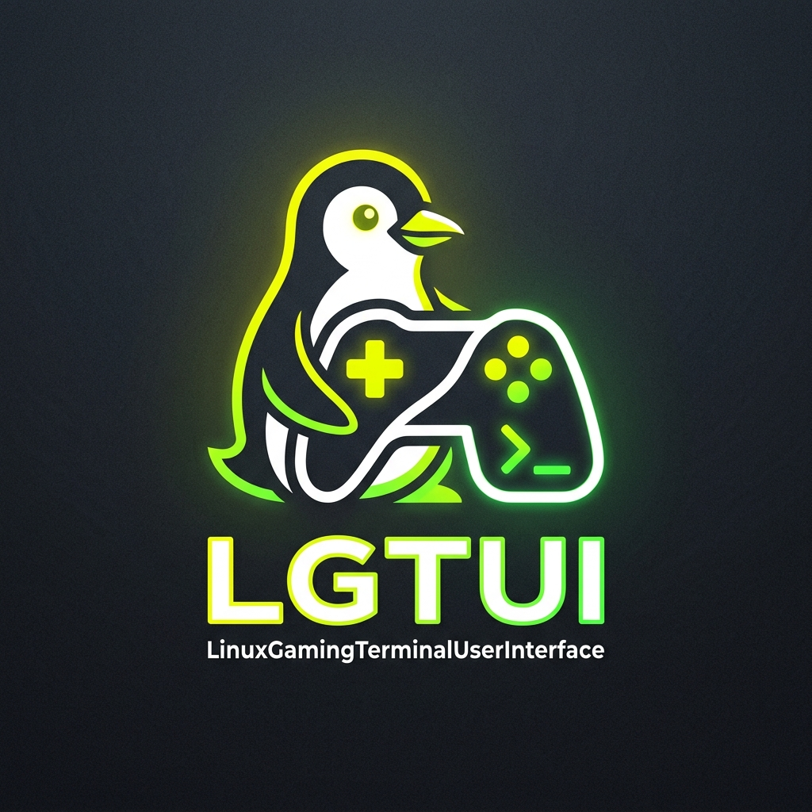
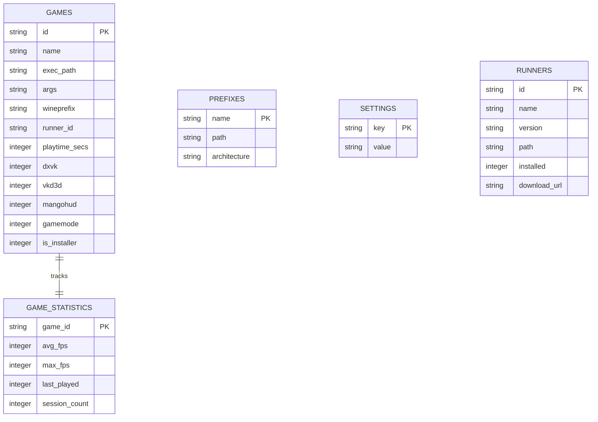

# LinuxGamingTerminalUserInterface (LGTUI)

<p align="center">
  
</p>

LGTUI is a robust, production-ready terminal user interface (TUI) client for managing Linux gaming ecosystems. It acts as a wrapper management system for Wine, Proton, Winetricks, MangoHud, and Feral GameMode, delivering console-based launcher controls and game statistics insights.

## Features

- **🎮 Game Library & Wrapper Configurations**: Easily add games, customize runner paths, manage separate prefix locations, and toggle wrappers like DXVK, VKD3D, MangoHud, and Feral GameMode.
- **📁 Dedicated Wine Prefix Manager**: Create new prefixes dynamically, boot/initialize prefixes safely via `wine boot -u`, and deregister or clean up files from your disk.
- **📊 Real-Time Playtime & Game Statistics**: Tracks game launches, last played timestamps (UTC formatted YYYY-MM-DD HH:MM), playtimes, session FPS averages, and maximum FPS logs using a local SQLite database.
- **⚙️ Runner Ecosystem**: Check, fetch, and download Proton-GE and Wine runners directly inside the TUI in real-time.
- **⚡ System Scan Onboarding & Diagnostics**: Scans host machines for dependencies (`wine`, `winetricks`, `mangohud`, `gamemode`) at startup and prompts to automatically install missing ones.
- **🗃️ Persistent SQLite Storage**: Stored at `~/.local/share/lgtui/lgtui.db`, eliminating scattered JSON/TOML configuration directories.

---

## Quick Installation

To install LGTUI directly without compiling from source, run:

```bash
curl -sSL https://raw.githubusercontent.com/lgtui/lgtui/main/scripts/install.sh | sh
```

*(Note: The installer automatically downloads the pre-built release binary, installs it to your local path, and registers a desktop application entry `lgtui.desktop` so you can launch it from your desktop launcher).*

### Building from Source

Ensure you have Rust and Cargo installed:

```bash
git clone https://github.com/lgtui/lgtui.git
cd lgtui
cargo build --release
```

The compiled binary will be available at `target/release/lgtui`.

---

## Keyboard Controls & Navigation

Navigation is designed to mimic standard Vim-like terminal navigation:

- **`Tab`**: Cycles pane focus sequentially: `Navigator Pane` -> `List Pane` -> `Details Pane` -> `Navigator Pane`.
- **`h` / `l` (Left/Right Arrows)**: Directly transitions focus to the left or right adjacent pane.
- **`j` / `k` (Down/Up Arrows)**: Navigates selections inside lists and configurations.
- **`Space`**: The **exclusive** toggle key for boolean checkboxes (e.g. DXVK, VKD3D settings, Settings page flags).
- **`Enter`**: Performs actions (launches games, downloads runners, boots prefixes, confirms modals).
- **`a`**: Opens the Add Game floating modal.
- **`n`**: Opens the Create Prefix floating modal.
- **`x`**: Deletes the selected game or prefix (prompts to confirm config removal and physical file deletions).
- **`?`**: Displays the interactive TUI Help Menu.
- **`q`**: Safely quits the TUI client.

---

## Database Schema

LGTUI stores all profiles, settings, and session details in a local SQLite file (`~/.local/share/lgtui/lgtui.db`) structured across these key tables:



---

## License

This project is licensed under the MIT License - see the LICENSE file for details.
