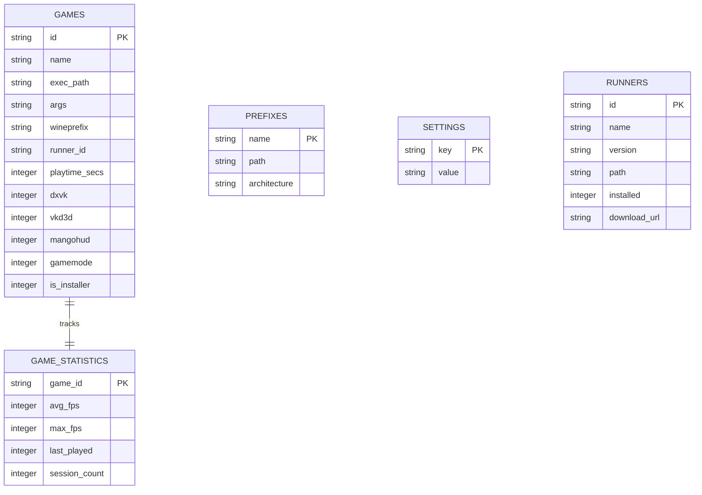

# LinuxGamingTerminalUserInterface (LGTUI)

<p align="center">
  
</p>

<p align="center">
  <a href="https://github.com/lgtui/lgtui/blob/main/LICENSE"></a>
  
  
  
</p>

---

LGTUI is a powerful, production-ready terminal user interface (TUI) client for managing Linux gaming configurations. Serving as a unified dashboard wrapper for **Wine**, **Proton**, **Winetricks**, **MangoHud**, and **Feral GameMode**, it delivers a seamless console-based game launcher, dynamic runtime statistics tracking, and prefix isolation management.

No cluttered configuration files, no complex GUI launcher overhead. Just pure terminal efficiency.

---

## ✨ Key Features

- **🎮 Game Library & Wrapper Management**: Easily catalog your games, customize runner paths, assign separate Wine/Proton prefixes, and toggle wrappers (DXVK, VKD3D, MangoHud, and Feral GameMode) with a single keystroke.
- **📁 Integrated Prefix Manager**: Build and initialize fresh prefixes dynamically via `wine boot -u`. Track prefix architectures, paths, and clean up physical directories directly from the interface.
- **📊 Runtime Statistics Engine**: Automatically tracks game sessions, logging launches, playtimes, session FPS averages, and maximum recorded frame rates in real-time.
- **⚙️ Runner Downloader**: Check, fetch, and download compatibility runners (like Proton-GE or custom Wine builds) directly within the TUI interface.
- **⚡ System Scan Diagnostics**: Auto-scans host machines for essential dependencies (`wine`, `winetricks`, `mangohud`, `gamemode`) during onboarding and prompts for guided installations.
- **🗃️ Single Source of Truth**: Completely powered by a local SQLite database (`~/.local/share/lgtui/lgtui.db`), replacing scattered JSON config directories.

---

## 🚀 Quick Start

### Easy Installation (Recommended)

Install LGTUI instantly using the POSIX binary installer. This script downloads the latest release, installs it to your local binary path, and registers a desktop application entry:

```bash
curl -sSL https://raw.githubusercontent.com/lgtui/lgtui/main/scripts/install.sh | sh
```

> **Note**: The installer registers `lgtui.desktop`, enabling you to launch LGTUI straight from your system application menu/runner.

### Building from Source

To compile and build LGTUI manually, ensure you have Rust and Cargo installed:

```bash
# Clone the repository
git clone https://github.com/lgtui/lgtui.git
cd lgtui

# Compile release binary
cargo build --release
```

The compiled binary will be located at `target/release/lgtui`.

---

## ⌨️ Keyboard Controls & Navigation

Navigation is designed to mimic standard Vim-like terminal movement:

| Key / Shortcut | Action | Description |
| :--- | :--- | :--- |
| **`Tab`** | **Cycle Pane Focus** | Moves focus: `Navigator` ➔ `List` ➔ `Details` ➔ `Navigator`. |
| **`h` / `l`** (or `←` / `→`) | **Direct Focus** | Directly shifts focus to the left or right adjacent pane. |
| **`j` / `k`** (or `↑` / `↓`) | **Navigate Lists** | Scroll up and down in lists, forms, and settings options. |
| **`Space`** | **Toggle Settings** | The **exclusive** key for toggling boolean checkmarks (DXVK, MangoHud, etc.). |
| **`Enter`** | **Execute Action** | Launches a selected game, initializes a prefix, or downloads a runner. |
| **`a`** | **Add Game** | Opens the Add Game floating modal dialogue. |
| **`n`** | **Create Prefix** | Opens the Create Prefix floating modal dialogue. |
| **`x`** | **Delete Item** | Deregisters a selected game or deletes a prefix (with optional disk cleanup). |
| **`?`** | **Help Overlay** | Opens the interactive help screen displaying control bindings. |
| **`q`** | **Quit TUI** | Safely exits the LGTUI application. |

---

## 🗄️ Database Architecture

LGTUI stores all game properties, system paths, execution arguments, settings, and gameplay metrics within a local SQLite database located at `~/.local/share/lgtui/lgtui.db`.



---

## 📄 License

This project is distributed under the MIT License. See [LICENSE](LICENSE) for details.
